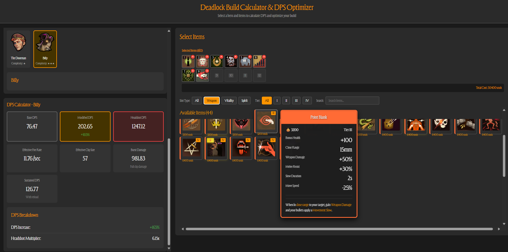

# Deadlock Build Calculator

A web-based build calculator and DPS optimizer for Deadlock. Create, customize, and analyze hero builds with real-time stat calculations.



## Features

- **Hero Selection**: Browse and select from all playable heroes
- **Item Management**: Select up to 12 items with filtering by slot type, tier, and search
- **Smart Tooltips**: Detailed item information with intelligent positioning
- **DPS Calculator**: Real-time damage calculations based on hero stats and item bonuses
- **Visual Enhancements**:
  - Slot numbers and item names on hover
  - Active item indicators
  - Smooth animations and transitions
  - Tier badges with Roman numerals

## Tech Stack

- React 18
- TypeScript
- Vite
- Deadlock API

## Getting Started

### Prerequisites

- Node.js 18+ and npm

### Installation

```bash
# Clone the repository
git clone https://github.com/sh0drun/deadlock-build-calculator.git
cd deadlock-build-calculator

# Install dependencies
npm install

# Start development server
npm run dev
```

The application will be available at `http://localhost:5173`

### Build for Production

```bash
npm run build
```

The built files will be in the `dist` directory.

## Development

```bash
# Run development server
npm run dev

# Type checking
npm run type-check

# Linting
npm run lint
```

## API

This project uses the [Deadlock API](https://docs.deadlock-api.com/) for hero and item data.

## License

MIT
